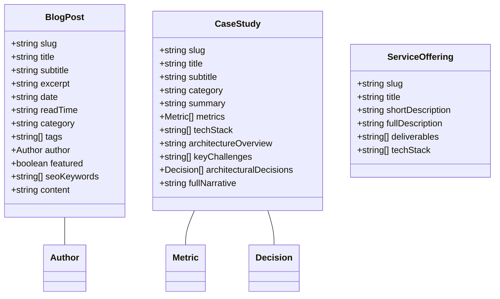

# PROJECT.md — Architecture Documentation

This document serves as the single source of truth for the **Abin S Chandran - Freelance Software Developer & Solution Architect Portfolio** codebase architecture, module organization, data flow, external integrations, and technical implementation decisions.

---

## 1. Project Overview

- **Project Name**: `abin-schandran-portfolio`
- **Domain**: `https://www.abinschandran.in`
- **Purpose**: High-performance, SEO-optimized personal portfolio and commercial services platform for Abin S Chandran (Freelance Full-Stack Developer & Solution Architect based in Kerala, India).
- **Current Status**: Production Active / Continuous Maintenance
- **Major Functionality**:
  - Commercial software development services presentation (`/services`, `/services/[slug]`)
  - Deep-dive technical case studies showcase (`/projects`, `/projects/[slug]`)
  - Engineering blog & architecture articles (`/blog`, `/blog/[slug]`)
  - Interactive CLI Terminal Shell for developer engagement & direct lead contact (`/contact`)
  - Interactive Architecture Playground & Live Metrics Dashboard (`/`)
  - Command Palette (`⌘K`), Konami Code Easter Egg, and smooth inertia scrolling
- **Primary Users/Roles**: Prospective clients (startups, enterprises), tech recruiters, fellow software engineers.
- **Architecture Type**: Next.js 15 App Router with 100% Static Site Generation (SSG) & React Server Components (RSC).
- **Repository Structure**: Single-package monolith web application.

---

## 2. Technology Stack

| Layer | Technology | Version | Purpose |
| :--- | :--- | :--- | :--- |
| **Framework** | Next.js (App Router) | `^15.1.7` | Static site pre-rendering, routing, SEO metadata API |
| **UI Engine** | React / React DOM | `^19.0.0` | Server & Client components |
| **Language** | TypeScript | `^5.7.3` | Type safety and strict interface definitions |
| **Styling** | Tailwind CSS / PostCSS | `^3.4.17` | Obsidian dark-mode design system & responsive layout |
| **Animations** | Framer Motion | `^12.4.7` | Smooth UI transitions & micro-interactions |
| **Scroll Engine** | Lenis | `^1.1.20` | Hardware-accelerated smooth inertia scrolling |
| **Icons** | Lucide React | `^0.475.0` | Lightweight SVG icon system |
| **Special Effects**| Canvas Confetti | `^1.9.4` | Interactive Konami easter egg celebration |
| **Email Dispatch**| Web3Forms API | Client-side HTTP | Serverless contact form submission directly to inbox |
| **Build System** | Next.js Build Worker | Node.js `^22` | Static HTML pre-rendering (`npm run build`) |

---

## 3. System Architecture

```mermaid
flowchart TD
    subgraph Browser ["User Browser (Client)"]
        Nav ["Navbar / Command Palette (⌘K)"]
        Pages ["Pages (RSC & Client Components)"]
        Terminal ["CLI Terminal Shell (/contact)"]
        LenisScroll ["Lenis Smooth Scroll Provider"]
        WA ["WhatsApp Sticky CTA"]
    end

    subgraph StaticBuild ["Next.js 15 SSG Engine (Build Time)"]
        AppRouter ["App Router (/app)"]
        DataStore ["Typed Static Content (/data)"]
        SitemapGen ["sitemap.ts Generator"]
        RobotsGen ["robots.ts Generator"]
        Redirects ["next.config.ts 301 Redirect Engine"]
    end

    subgraph ExternalServices ["External API Services"]
        W3F ["Web3Forms API (Email Dispatch)"]
        WAService ["WhatsApp Web Direct Link"]
        GSC ["Google Search Console / Indexing"]
    end

    Pages --> DataStore
    AppRouter --> StaticBuild
    StaticBuild --> Pages
    SitemapGen --> GSC
    Terminal -->|HTTP POST| W3F
    WA -->|Direct Link| WAService
    Redirects -->|301 Redirect /resume -> /about| AppRouter
```

---

## 4. Project Directory Structure

```text
Personal _Portfolio/
├── app/                             # Next.js 15 App Router Pages & Layouts
│   ├── about/                       # About & Philosophy Page (/about)
│   │   └── page.tsx
│   ├── blog/                        # Tech Blog & Case Studies Module (/blog)
│   │   ├── [slug]/
│   │   │   └── page.tsx             # Dynamic SSG Article Page (/blog/[slug])
│   │   └── page.tsx                 # Blog Index Page
│   ├── contact/                     # Interactive CLI Terminal Page (/contact)
│   │   └── page.tsx
│   ├── projects/                    # Case Studies Module (/projects)
│   │   ├── [slug]/
│   │   │   └── page.tsx             # Dynamic Project Detail Page (/projects/[slug])
│   │   └── page.tsx                 # Project Catalog Page
│   ├── services/                    # Commercial Services Module (/services)
│   │   ├── [slug]/
│   │   │   └── page.tsx             # Dynamic Service Detail Page (/services/[slug])
│   │   └── page.tsx                 # Service Catalog Page
│   ├── AppShell.tsx                 # Global Client Wrapper (Navbar, Footer, Modals, Lenis)
│   ├── globals.css                  # Custom Obsidian Theme Tokens & CSS Variables
│   ├── layout.tsx                   # Root HTML Layout with Font Loaders & JsonLd
│   ├── page.tsx                     # System Overview Homepage (/)
│   ├── robots.ts                    # Dynamic robots.txt route handler
│   └── sitemap.ts                   # Dynamic sitemap.xml route handler
├── components/                      # UI Component System
│   ├── architecture/                # Architecture Playground Interactive Component
│   ├── blog/                        # BlogCard, ArticleContent, HomeBlogSection
│   ├── cta/                         # Conversion CTA Banners
│   ├── dashboard/                   # Performance Dashboard Metrics Component
│   ├── faq/                         # Frequently Asked Questions Component
│   ├── hero/                        # Hero Banner Section
│   ├── projects/                    # ProjectCard, ProjectGrid
│   ├── seo/                         # JsonLd Structured Data Generator (Schema.org)
│   ├── services/                    # ServiceCard, ServicesSection
│   ├── skills/                      # SkillMatrixBento Component
│   ├── terminal/                    # Interactive Terminal CLI Shell Component
│   ├── timeline/                    # Career & Work Timeline Component
│   └── ui/                          # Global Shell UI (Navbar, Footer, CommandPalette, WhatsApp, Konami)
├── data/                            # Typed Content Models (Single Source of Truth)
│   ├── blog.ts                      # Engineering articles dataset & types
│   ├── faq.ts                       # Commercial & technical FAQs
│   ├── projects.ts                  # In-depth architectural project case studies
│   ├── services.ts                  # Freelance service packages & offerings
│   ├── skills.ts                    # Technology skills & proficiency levels
│   └── timeline.ts                  # Career milestones & architectural timeline
├── public/                          # Static Assets & Verification Files
│   ├── og-image.png                 # OpenGraph Social Sharing Banner
│   ├── photo.png                    # Profile Image Avatar
│   ├── google323ad084142dea2e.html  # Google Search Console Domain Verification File
│   └── abin-s-chandran-solution-architect-resume.pdf # Resume PDF
├── next.config.ts                   # Next.js Build Config, ViewTransitions, & 301 Redirects
├── tailwind.config.ts               # Custom Obsidian Color Palette & Font Config
├── tsconfig.json                    # TypeScript Strict Mode Config
└── PROJECT.md                       # System Architecture & Development Document
```

---

## 5. Application Modules

### 1. Navigation & AppShell Module (`app/AppShell.tsx`, `components/ui/`)
- **Responsibilities**: Manages persistent navigation header, footer, global `⌘K` keyboard event listener for Command Palette, Konami code sequence detector, WhatsApp float button, and smooth scrolling via `SmoothScrollProvider.tsx`.

### 2. Commercial Services Module (`app/services/`, `data/services.ts`)
- **Responsibilities**: Showcases high-level software offerings (Full-Stack Development, Node.js API Engineering, Next.js SaaS, Flutter Cross-Platform Apps, Performance Optimization, Solution Architecture). Generates SSG static detail pages per service slug.

### 3. Projects & Case Studies Module (`app/projects/`, `data/projects.ts`)
- **Responsibilities**: Presents detailed engineering case studies with tech stack tags, architecture overviews, key challenges, trade-off decisions, and quantitative metrics (e.g. sub-15ms response times, 60fps mobile rendering).

### 4. Tech Blog & Engineering Guides Module (`app/blog/`, `data/blog.ts`)
- **Responsibilities**: Houses long-tail technical guides (Flutter mobile 60fps architecture, Node.js REST API scaling, Next.js 15 SaaS architecture). Provides structured Markdown rendering (`ArticleContent.tsx`), category filtering, and `BlogPosting` Schema.org JSON-LD structured data.

### 5. Interactive CLI Terminal Module (`components/terminal/`, `app/contact/`)
- **Responsibilities**: Provides an interactive terminal shell interface. Accepts commands (`help`, `about`, `skills`, `projects`, `contact`, `whatsapp`, `send <message>`, `clear`). Integrates with Web3Forms to submit lead messages asynchronously without page reloads.

### 6. Interactive Architecture Playground & Metrics (`components/architecture/`, `components/dashboard/`)
- **Responsibilities**: Live interactive diagram component allowing visitors to toggle system loads (1k RPS, 10k RPS, 50k RPS) and visualize microservice telemetry, cache hit ratios, and server response metrics.

---

## 6. Backend & Server-Side Architecture

Although this application renders as a static frontend, server-side features are managed via Next.js App Router static capabilities:

- **Static Site Generation (SSG)**: All routes (`/`, `/about`, `/blog`, `/blog/[slug]`, `/projects`, `/projects/[slug]`, `/services`, `/services/[slug]`, `/contact`) pre-render to static HTML at build time using `generateStaticParams()`.
- **Dynamic Sitemap Generation (`app/sitemap.ts`)**: Auto-builds standard `sitemap.xml` with priority scores (`1.0` for Home, `0.95` for Blog & Services, `0.9` for Case Studies).
- **Dynamic Robots Configuration (`app/robots.ts`)**: Serves `robots.txt` allowing crawler access and pointing to `https://www.abinschandran.in/sitemap.xml`.
- **301 Permanent Redirects (`next.config.ts`)**: Preserves SEO authority by permanently redirecting legacy routes (e.g., `/resume` ➔ `/about`).

---

## 7. Frontend Architecture

- **Page Layout System**: All pages wrap inside `RootLayout` (`app/layout.tsx`) which initializes font variables (`--font-inter`, `--font-jetbrains-mono`), global JSON-LD schemas (`Person`, `ProfessionalService`), and `AppShell`.
- **State Management**:
  - Local component state via React `useState` / `useEffect` / `useRef`.
  - Path tracking via `usePathname()` in `Navbar.tsx` for dynamic active link highlighting.
  - Global `⌘K` listener in `AppShell.tsx` passed down to `CommandPalette.tsx`.
- **Smooth Scroll Engine**: `SmoothScrollProvider` initializes Lenis smooth scrolling with custom cubic-bezier easing.

---

## 8. Database & Content Architecture

The application uses typed TypeScript data modules in `data/` as its zero-latency static database.



---

## 9. API Architecture & External Integrations

### Internal Route Handlers
| Route | Output Type | Purpose |
| :--- | :--- | :--- |
| `/sitemap.xml` | XML | Search engine sitemap generated by `app/sitemap.ts` |
| `/robots.txt` | Text | Search crawler directives generated by `app/robots.ts` |

### External Third-Party APIs
| Service | Method | Endpoint | Purpose |
| :--- | :--- | :--- | :--- |
| **Web3Forms API** | `POST` | `https://api.web3forms.com/submit` | Client-side email dispatch from interactive CLI terminal |
| **WhatsApp Web API** | Direct URL | `https://wa.me/{number}?text={encoded}` | Direct instant chat initiation from float button / terminal |

---

## 10. Authentication & Authorization

This is a public commercial portfolio and technical documentation platform.
- **Access Control**: Publicly accessible. No user login or auth tokens required.
- **Administrative Access**: Content updates managed via Git repository commits.

---

## 11. Data Flow Workflows

### Visitor Terminal Contact Workflow
```text
Visitor types 'send Hello, I need a Flutter app' in Terminal
  ↓
InteractiveTerminal component captures command
  ↓
Validates input & extracts message payload
  ↓
Sends asynchronous POST request to Web3Forms API
  ↓
Web3Forms dispatches email directly to abinschandran1@gmail.com
  ↓
Terminal displays success response & status log to visitor
```

### Search Engine Crawling Workflow
```text
GoogleBot requests sitemap.xml
  ↓
Next.js serves pre-rendered XML from app/sitemap.ts
  ↓
Crawler reads all static URLs (/services/[slug], /blog/[slug], /projects/[slug])
  ↓
Crawler inspects Schema.org JSON-LD (Person, ProfessionalService, BlogPosting) in <head>
  ↓
Google updates index & rich search snippet listings
```

---

## 12. Environment & Configuration

Environment variables are configured in `.env.local` (local development) and platform environment settings (production):

| Variable | Description | Exposure |
| :--- | :--- | :--- |
| `NEXT_PUBLIC_WEB3FORMS_ACCESS_KEY` | Public Web3Forms API key for terminal email dispatch | Client-side (`NEXT_PUBLIC_`) |
| `NEXT_PUBLIC_WHATSAPP_NUMBER` | Contact phone number formatted for WhatsApp Web links | Client-side (`NEXT_PUBLIC_`) |

*Note: No secret database credentials or private keys exist in this repository.*

---

## 13. Deployment Architecture

- **Hosting Provider**: Vercel / Cloudflare Pages / Static Web Server
- **Build Command**: `npm run build`
- **Output Artifact**: Fully static HTML, CSS, JavaScript chunks in `.next/`
- **Domain Configuration**: Primary canonical domain `https://www.abinschandran.in` with automatic non-www to www redirect.

---

## 14. Important Business Logic

1. **301 SEO Preservation**: When legacy routes like `/resume` are deprecated, a `301 Permanent Redirect` rule in `next.config.ts` transfers page authority directly to `/about`.
2. **Command Palette Search (`⌘K`)**: Case-insensitive multi-field match across site navigation links, blog posts (`BLOG_POSTS`), and case studies (`PROJECTS`).
3. **Konami Code Listener**: Sequences key presses (`ArrowUp`, `ArrowUp`, `ArrowDown`, `ArrowDown`, `ArrowLeft`, `ArrowRight`, `ArrowLeft`, `ArrowRight`, `b`, `a`). Fires full-screen `canvas-confetti` explosion upon activation.

---

## 15. Key Dependencies

- `next` (`^15.1.7`): Core React framework.
- `react` / `react-dom` (`^19.0.0`): Rendering library.
- `lucide-react` (`^0.475.0`): Clean UI icon set.
- `lenis` (`^1.1.20`): Smooth scroll physics engine.
- `framer-motion` (`^12.4.7`): Animation system.
- `canvas-confetti` (`^1.9.4`): Particle celebration engine.

---

## 16. Security Architecture

- **Headers**: Enforces `rel="noopener noreferrer"` on all external links (GitHub, LinkedIn, WhatsApp).
- **Client-Side Secret Shield**: Only public `NEXT_PUBLIC_` variables exposed to browser bundles.
- **Sanitization**: Form inputs in CLI terminal sanitized prior to API dispatch.

---

## 17. Testing & Verification

- **Build Verification**: Executing `npm run build` validates static route generation across all 27+ pages.
- **Type Checking**: Executing `npx tsc --noEmit` verifies strict TypeScript validity across components and data models.
- **Linting**: `npm run lint` enforces Next.js code standards.

---

## 18. Architecture Change Log

### 2026-08-13
- **Added**: Initial creation of `PROJECT.md` source-of-truth documentation file.
- **Added**: Tech Blog & Case Studies system (`/blog`, `/blog/[slug]`, `data/blog.ts`, `BlogCard.tsx`, `ArticleContent.tsx`, `HomeBlogSection.tsx`).
- **Added**: `BlogPosting` JSON-LD Schema.org structured data support in `JsonLd.tsx`.
- **Changed**: Updated `sitemap.ts`, `Navbar.tsx`, `Footer.tsx`, and `CommandPalette.tsx` to integrate `/blog` section.
- **Removed**: Deprecated standalone `/resume` page (`app/resume/page.tsx`).
- **Added**: Configured 301 Permanent Redirect in `next.config.ts` (`/resume` ➔ `/about`) to preserve SEO authority.
